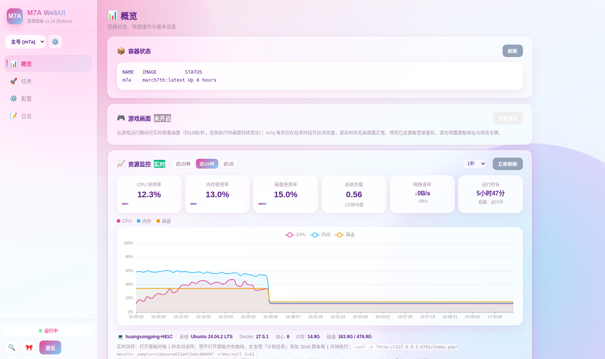
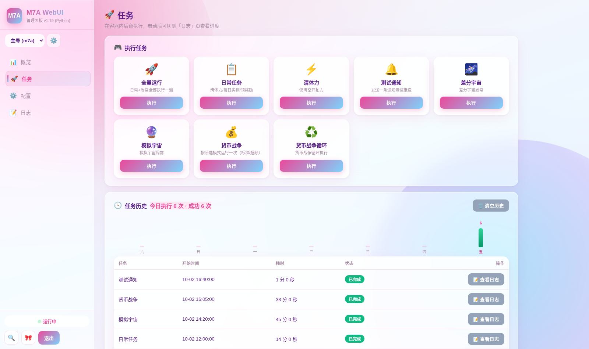
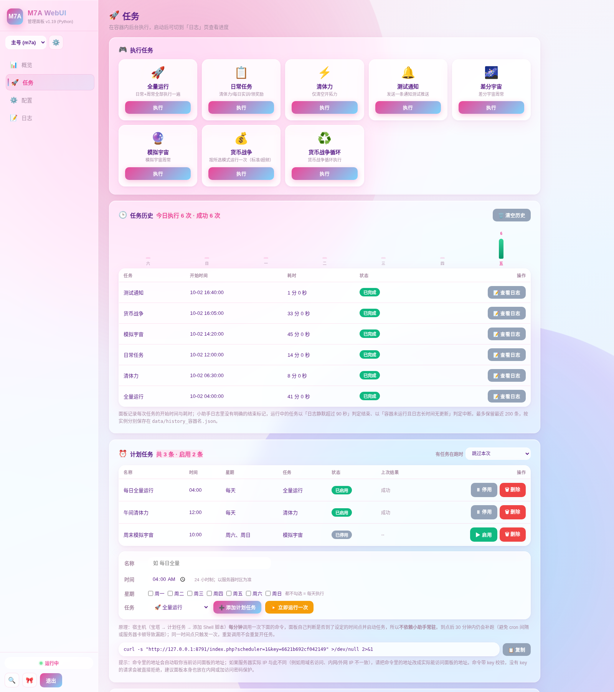
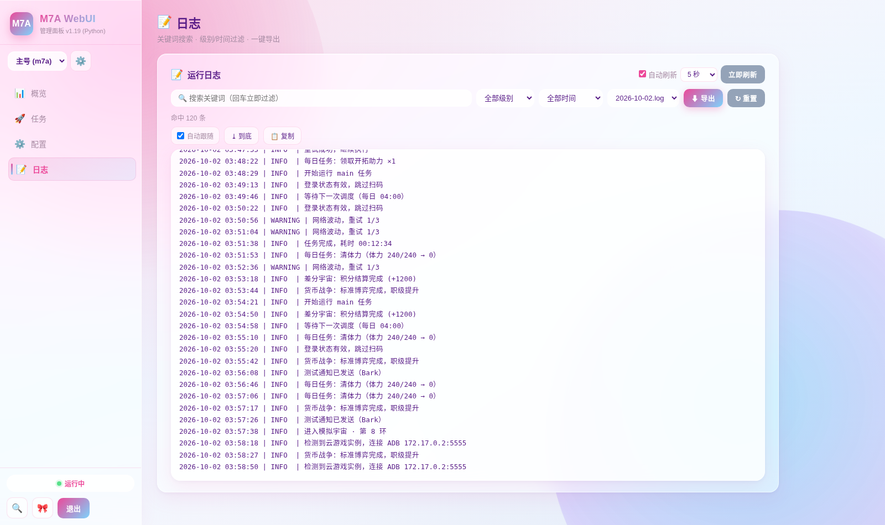
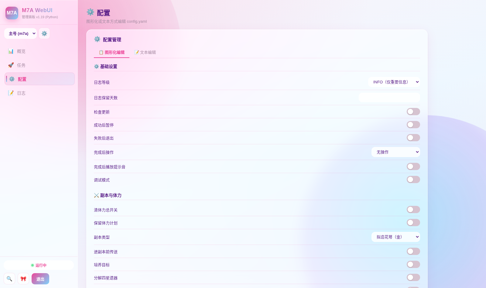
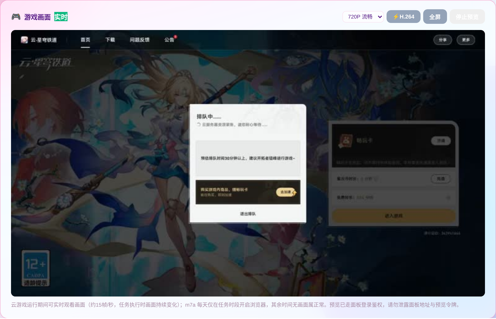
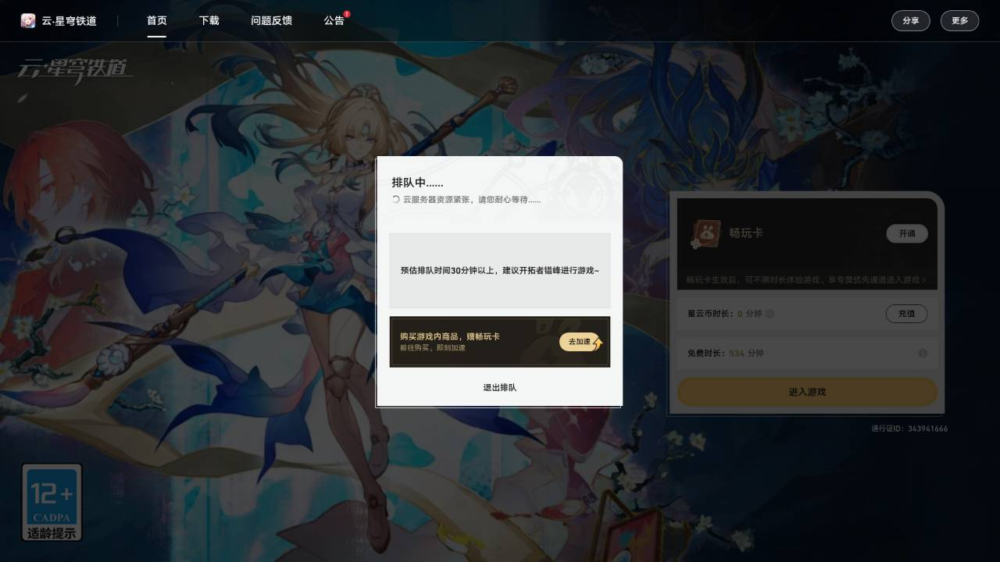

# March7th 小助手网页管理面板（Python 重制版）

> 浏览器里管三月七小助手，告别 SSH 命令行。


## 项目详细介绍

> ⚠️ **本面板为第三方开发的配套管理工具，非官方出品，与米哈游（HoYoverse）无关。**

本面板是 [三月七小助手（March7thAssistant）](https://github.com/moesnow/March7thAssistant) 的配套网页管理工具。原项目跑在电脑上的 GUI / 命令行程序，人不在电脑前就没法操作；把小助手部署到服务器后，你用手机或电脑浏览器就能随时远程管理——启动日常任务、清体力、改配置、看日志、盯监控，全程不需要命令行。

一个由 **Python 3.11+ / FastAPI / Uvicorn** 全栈驱动的现代化管理面板：systemd 常驻、崩溃自动重启，不依赖 fastcgi 等传统链路；实时数据通过 **WebSocket 事件流**推送，监控按秒级采样刷新（cgroup 直读、零子进程，开销极低）；游戏画面预览采用 **CDP 帧流反代 + 按日 HMAC 令牌**，支持 720P/480P 切档、H.264 15/30 帧可选与断线重连。界面与操作习惯保持延续，登录态、面板配置、实例列表、密码文件全部直接复用，升级无需迁移数据。

- ✅ 适配已部署 Docker 版小助手的玩家；还没部署的，先按下方 [快速开始](#-快速开始--部署教程) 从零搞定（约 20 分钟）
- ✅ 纯 Python 依赖、文件存储（JSON + SQLite 事件库），**无需数据库**，开箱即用
- ✅ 181 个 pytest 自动化测试、`routers` / `services` 清晰分层，方便二次开发
- ✅ 手机、电脑浏览器均可使用

## ✨ 核心特性

### 🚀 核心管理

- **多实例切换**：侧边栏下拉一键切换多个小助手实例（多账号 / 多容器），每个实例独立管理任务、配置、日志
- **实时状态**：容器运行状态徽章 + 自动刷新，WebSocket 断线自动重连
- **执行任务**：全量运行 / 日常任务 / 清体力 / 测试通知 / 差分宇宙 / 模拟宇宙 / 货币战争 / 货币战争循环，一键触发
- **一键链式启动与随时停止**：点快捷操作若小助手未运行会自动拉起并接着执行任务；概览页常驻「⏹️ 停止任务」「⏸️ 停止小助手」按钮，随时可控
- **运行中任务悬浮条**：有任务在跑时屏幕边缘浮出悬浮条，实时显示任务名与已运行时长，随时 ⏹ 停止、点 📝 直达日志
- **底部中央快捷键**：中央圆钮点一下弹出任务清单想跑哪个点哪个，长按弹容器操作菜单（重启 / 停止 / 更新镜像）
- **任务执行历史**：自动记录每次任务的开始时间、耗时与结果，顶部显示「今日执行 N 次 · 成功 X 次」；运行中 / 已完成 / 已中断三色徽章，按实例保存、保留最近 200 条
- **计划任务**：支持「每天 / 指定星期 + 时间点」定时跑任意任务，可启停、删除、一键「立即运行一次」；由宿主机 cron 每分钟调用面板触发，**不依赖小助手常驻**，30 分钟补跑窗口 + 同一时间点只触发一次，触发接口带 key 校验
- **容器操作四按钮**：重启容器、停止任务（重启容器）、停止循环（轻量，仅停货币战争循环）、停止容器（`docker compose stop`，不删数据）
- **任务结束后设置**：一键切换「跑完自动退出游戏 / 跑完保持界面」
- **资源监控仪表盘**：CPU / 内存 / 磁盘 / 负载 / 网络速率 / 运行时长六个指标实时跳动 + 三条实时曲线（近 1 分钟 / 1 小时 / 1 天切换），主机信息（系统 / Docker 版本 / 核心 / 内存 / 磁盘）自动采集；面板不开曲线也不断——卡片内一键复制带 key 的采样 curl 命令挂到宿主 cron 即可
- **小助手镜像检查与更新**：直查 GHCR 官方镜像 latest 发布时间（不再误报），一键更新镜像并自动依次尝试官方源 / 南大 / DaoCloud / dockerproxy 加速源
- **面板自动更新 + 版本备份回滚**：打开面板自动检查新版本，更新前自动备份当前版本到 `backups/`（保留 5 份），概览页一键回滚，回滚前再备份一次防手滑；附带更新源连通性一键测试
- **游戏画面实时预览**：概览页一键开启实时观看云游戏画面（JPEG 约 15 帧/秒，H.264 极致档可选 15 / 30 帧），720P / 480P 切换与全屏，按日轮换 HMAC 令牌鉴权，断线自动重连、切后台自动省流
- **一键体检**：自动检查 Docker 权限、容器状态、配置可写、推送通道、计划任务心跳、镜像与面板版本、磁盘空间等 10 项，按 ✅⚠️❌ 分级给出问题与建议
- **异常主动告警**：Bark / Server 酱 / Webhook 推送通道，容器掉线、任务被中断、久无输出第一时间推到手机，可一键发送测试消息

### ⚙️ 配置编辑

- **图形化配置编辑**：覆盖日常、体力、模拟宇宙、活动、通知推送等 160+ 常用配置项，分组表单（开关 / 下拉 / 输入框），冷门分组可折叠
- **消息推送可视化配置**：全部推送渠道集中图形化配置（Server 酱 / Bark / 钉钉 / 企业微信 / 飞书 / Telegram / PushPlus / Gotify / Discord / SMTP / Webhook / Matrix / PushDeer / KOOK / OneBot 等），每个字段写清填法，附「保存并发送测试推送」与「保存并体检」
- **高级文本编辑**：完整 YAML 直接编辑（改队伍配置等复杂结构）
- **安全保存**：保存前自动备份 `config.yaml.bak.时间戳`，保留注释；支持一键下载 / 上传恢复配置备份

### 🎨 界面体验

- **星铁粉蓝渐变主题（默认）**：粉色→浅蓝渐变主视觉 + 玻璃拟态卡片；星铁粉蓝 / 亮色 / 深色三态循环切换
- **侧边栏布局**：左侧固定导航（概览 / 任务 / 配置 / 日志），手机端自动变抽屉 + 底部胶囊悬浮导航
- **移动端适配**：三档断点、触控目标 ≥44px、边缘左右滑切页、iPhone 底部安全区适配；支持「添加到主屏幕」（PWA）独立 App 体验
- **全局搜索**：侧边栏与手机顶栏 🔍，输关键词直达任务、页面、配置项与常用操作
- **日志高级查询**：关键词搜索高亮、级别 / 时间过滤、多日志文件切换、一键导出、命中计数、自动跟随 / 到底 / 复制工具条
- **回到顶部、通知自动淡出、动效与性能降级**：低配机自动去磨砂换实底，流畅不掉帧

### 🛡️ 安全与运行时

- **密码保护**：首次访问设置密码，bcrypt 哈希存储于 `.panel_pass.php`；登录限速、会话轮换
- **CSRF 防护**：全部写操作带 CSRF 校验；计划任务 / 监控采样 / 告警巡检等触发接口必须带 key，无 key 或 key 错误返回 403
- **WebSocket 事件流**：日志、监控、告警实时推送，页面无需刷新
- **systemd 常驻**：`Restart=always` 崩溃自动重启、开机自启；默认仅监听 `127.0.0.1`
- **可靠数据落盘**：监控数据原子写（临时文件 + `os.replace`），杜绝并发写坏 JSON
- **可测试**：pytest 回归 `181 passed, 3 skipped`，路由层与业务层分离

## 界面预览 / 效果展示

截图均为面板真实运行画面，源文件位于仓库 [`assets/`](./assets/) 目录。

**概览页：容器状态、游戏画面卡片与资源监控**



**任务页：一键执行任务与任务历史**



**任务历史与计划任务（含可直接复制的触发命令）**



**日志页：搜索、过滤与导出**



**配置页：图形化编辑与分组表单**



**游戏画面实时预览：不用远程桌面、不用投屏，浏览器直连实时观看云游戏画面，挂机、排队、战斗进度一眼可见（JPEG / H.264 极致档）**



预览中的真实游戏画面（720P 实时截帧）：



## 🎮 游戏画面实时预览（特色功能）

### 工作原理

```text
容器 preview_server（CDP 抓帧） → MJPEG / WebSocket 帧流（127.0.0.1:9223）
        → 面板鉴权 + 反向代理（按日 HMAC 令牌）
            → 浏览器渲染：JPEG 逐帧 ｜ 或 ffmpeg 转 H.264 → MSE 极致档
```

- **两档画质 + 帧率可选**：点「实时」徽章旁的档位下拉切换 `720P / 480P`；编码方式可选 JPEG 与 ⚡H.264（H.264 档帧率可选 15 / 30 帧，30 帧更流畅、15 帧更省流）
- **按日令牌鉴权**：令牌 = `HMAC-SHA256(密钥, 当天日期)` 截断 32 位，**每天自动轮换**，
  泄露的令牌过期即失效；面板与容器双端校验，不经外网端口暴露
- **断线自动重连**：网络抖动按指数退避重连；切到后台标签页自动降频省流
- **独立会话防竞态**：多人同时点预览互不踢线，各自独立会话

### 两档编码怎么选

| 档位 | 编码 | 帧率 | CPU 占用 | 适用场景 |
|---|---|---|---|---|
| 默认（流畅） | JPEG 逐帧 | ~15 帧/秒 | 极低 | 挂机看进度、低配服务器 |
| ⚡H.264（极致） | H.264 → fMP4 (MSE) | 15 / 30 帧可选 | 需 ffmpeg 转码 | 画面更细腻、拖动/文字边缘更清晰；30 帧更流畅、15 帧更省流 |

**开启 H.264 极致档**（服务器装一次即可，装完不用重启面板）：

```bash
sudo apt-get update && sudo apt-get install -y ffmpeg
ffmpeg -hide_banner -encoders | grep libx264   # 确认包含 libx264
```

### 安全与使用提示

- 预览流与令牌**仅在面板内使用**，不要把带令牌的链接转发他人（令牌按天失效，但当天内有效）
- 面板默认只监听 `127.0.0.1`，外网访问请走 Nginx 反代并保证 HTTPS/WSS
- 预览会占用少量容器 CPU（CDP 抓帧）与带宽（720P 约几百 KB/s 量级），低配机器建议 480P

> 预览遇到「403 / 无画面 / 未安装 ffmpeg」等问题？完整排查过程见
> [TROUBLESHOOTING.md](./TROUBLESHOOTING.md)。

## 环境依赖与前置要求

### 必需组件

| 组件 | 版本要求 | 说明 |
|---|---|---|
| Python | **3.11+**（推荐 3.12，实测版本） | 面板运行时 |
| pip | 随 Python 3.11+ 自带 | 依赖安装 |
| Git | 任意近期版本 | 克隆仓库 |
| Docker + March7th Assistant 容器 | 任意 | 面板的管理对象，需已在运行 |

### Python 依赖（`panel_migr/requirements.txt`）

```text
fastapi>=0.110
uvicorn[standard]>=0.29
httpx>=0.27
bcrypt>=4.1
python-multipart>=0.0.9
jinja2>=3.1
```

### 服务器配置

- **面板本体**：1 核 CPU / 1 GB 内存即可（面板极轻量，监控数据占用可忽略）
- **连同小助手一起跑**：建议 **2 核 CPU / 4 GB 内存**以上（小助手容器运行约需 1 GB+ 内存）；系统 Ubuntu 20.04+ / Debian 11+ / CentOS 7.9+
- 数据库：**无需外部数据库**，面板使用文件存储（JSON + SQLite 事件库）

### 可选组件

- **Nginx**（生产环境反向代理与 WebSocket 升级、HTTPS）
- **systemd**（Linux 常驻部署，几乎所有发行版自带）
- **ffmpeg**（`M7A_FFMPEG` 指定路径，预览转码时使用）

> 本面板**不内置数据库、不自动安装 Docker、不负责部署 March7th 本体**。请先确认 `docker ps` 能看到 March7th 容器，再部署面板。

## 🚀 快速开始 / 部署教程

### 方式一：本地开发部署

适合二次开发与调试，单进程直接启动，无需 root。

1. 克隆仓库：

```bash
git clone https://github.com/Starchaser-Cyber/march7th-assistant-web-management-panel-python-remake.git
cd march7th-assistant-web-management-panel-python-remake/panel_migr
```

2. 创建虚拟环境并安装依赖：

```bash
python3 -m venv .venv
.venv/bin/pip install -r requirements.txt
```

> **踩坑提示**：必须在虚拟环境里安装依赖。直接用系统 pip 安装可能因 PEP 668（externally-managed-environment）报错；跳过 `bcrypt` 等依赖会导致启动即 `ModuleNotFoundError`。

3. 启动开发服务（默认监听 `127.0.0.1:8787`）：

```bash
M7A_PANEL_DIR="$(pwd)/.." .venv/bin/python main.py
```

4. 运行测试确认环境正常：

```bash
.venv/bin/python -m pytest -q
.venv/bin/python -m compileall -q .
```

预期结果：`181 passed, 3 skipped`。

5. 浏览器访问：

```text
http://127.0.0.1:8787
```

### 方式二：生产环境部署（systemd）

适合长期运行的服务器，配合 systemd 实现常驻与开机自启。

1. 克隆代码到服务器固定目录（示例为 `/opt`，可自行替换）：

```bash
git clone https://github.com/Starchaser-Cyber/march7th-assistant-web-management-panel-python-remake.git /opt/m7a-panel-repo
```

2. 创建面板数据目录并安装依赖：

```bash
mkdir -p /srv/m7a-panel
cd /opt/m7a-panel-repo/panel_migr
python3 -m venv .venv
.venv/bin/pip install -r requirements.txt
```

> **关键注意事项**：`M7A_PANEL_DIR` 指向的是**面板数据目录**（存放 `.panel_config.php`、`.instances.php`、`.panel_pass.php`、`data/` 的位置）。若要复用现有面板的全部配置与数据，直接指向原面板数据目录即可；全新部署则指定一个空目录。**不要照抄他人的生产路径**。

3. 创建 systemd 服务文件 `/etc/systemd/system/m7a-panel.service`：

```ini
[Unit]
Description=M7A Panel (Python)
After=network.target docker.service

[Service]
User=root
WorkingDirectory=/opt/m7a-panel-repo/panel_migr
Environment=M7A_PANEL_DIR=/srv/m7a-panel
Environment=M7A_LISTEN_HOST=127.0.0.1
Environment=M7A_LISTEN_PORT=8787
ExecStart=/opt/m7a-panel-repo/panel_migr/.venv/bin/python main.py
Restart=always
RestartSec=3

[Install]
WantedBy=multi-user.target
```

4. 启用并启动服务：

```bash
systemctl daemon-reload
systemctl enable --now m7a-panel
systemctl status m7a-panel
```

5. 验证服务：

```bash
systemctl is-active m7a-panel      # 预期输出: active
curl -I http://127.0.0.1:8787      # 预期输出: HTTP/1.1 200 OK
```

6. （可选）Nginx 反向代理对外提供访问（**WebSocket 必需三个头**）：

```nginx
server {
    listen 80;
    server_name your-domain.example;

    location / {
        proxy_pass http://127.0.0.1:8787;
        proxy_http_version 1.1;
        proxy_set_header Upgrade $http_upgrade;
        proxy_set_header Connection "upgrade";
        proxy_set_header Host $host;
        proxy_read_timeout 3600s;
    }
}
```

```bash
nginx -t && systemctl reload nginx
```

> **安全提示**：默认监听 `127.0.0.1`，外网访问请通过 Nginx 反代并配置防火墙规则，**不要**将管理端口直接暴露到公网。首次部署后请立即设置强密码，且不要把 `.panel_pass.php`、`.env`、会话文件、监控数据提交进 Git。

### 方式三：从零部署小助手本体（可选）

还没部署三月七小助手的玩家走这一节；已部署过直接跳到上方方式二。完整步骤整理自 [原项目官方 Docker 教程](https://github.com/moesnow/March7thAssistant/blob/main/assets/docs/Docker.md)。

**1. 安装 Docker**

```bash
curl -fsSL https://get.docker.com | bash
systemctl enable --now docker
```

国内服务器建议配置 `/etc/docker/daemon.json` 的 `registry-mirrors` 加速，验证：`docker -v`。

**2. 启动小助手容器**

> 小助手 Docker 模式仅支持**云·星穹铁道**（云游戏），首次运行需用米游社 APP 扫码登录。

```bash
mkdir -p /home/march7thassistant && cd /home/march7thassistant
curl -o config.yaml https://m7a.top/assets/config/config.example.yaml
curl -o docker-compose.yml https://m7a.top/docker-compose.yml
```

编辑 `docker-compose.yml`：注释掉 `build: .`、启用 `image:` 行（中国大陆可用南京大学镜像 `ghcr.nju.edu.cn/moesnow/march7thassistant:latest`），并确认存在 `shm_size: 1g`（避免浏览器崩溃）。然后：

```bash
docker compose up -d     # 首次拉取镜像约 1-2GB
```

**3. 扫码登录（关键）**

首次运行自动进入二维码登录模式：二维码图片在 `/home/march7thassistant/logs/qrcode_login.png`，用手机**米游社 APP** 扫码；或 `docker compose logs -f` 查看日志里的二维码网址。验证：`docker compose ps` 显示 Up、日志出现「开始运行」相关输出即正常。

**4. 手动执行任务（面板按钮调用的就是这些命令）**

| 任务 | 命令 |
|------|------|
| 全量运行 | `docker exec m7a python main.py main` |
| 仅日常任务 | `docker exec m7a python main.py daily` |
| 清体力 | `docker exec m7a python main.py power` |
| 差分宇宙 | `docker exec m7a python main.py divergent` |
| 测试通知推送 | `docker exec m7a python main.py notify` |

小助手默认**每天凌晨 4:00 自动执行完整任务**，任务完成后自动循环等待。

## 使用说明 / 功能指南

### 首次访问

1. 部署完成后访问 `http://127.0.0.1:8787`（或你的反代域名）。
2. 全新部署时按页面提示设置管理员密码；从旧版面板切换则沿用原密码（密码文件共享）。
3. 登录后主界面依次为：实例状态卡片 → 游戏画面卡片 → 资源监控 → 任务按钮 → 计划任务 / 历史 → 日志流。
4. 实例列表里填好「容器名」（`docker ps` 里的 NAME）与「小助手目录」（宿主机上含 `config.yaml` / `logs/` 的绝对路径），多账号点侧边栏下拉切换。

### 主要功能模块

- **仪表盘**：容器状态、系统资源与最近事件；WebSocket 连接建立后数据自动刷新，断开时页面显示重连提示。
- **任务管理**：点击任务卡片触发（`main` 全量运行、`daily` 日常任务、`power` 清体力等）；危险动作（`restart`、`update`、`stop` 等）触发二次确认并静默告警 600 秒。
- **日志与历史**：实时日志流 + 最近 200 条任务历史；日志静默超过 90 秒视为任务结束并自动算好耗时，容器已停止且日志久不更新标记为「已中断」。
- **游戏画面预览**：进入预览自动向容器内 `preview_server`（默认端口 `9223`）申请帧流；支持 720P/480P 切换与 15 / 30 帧（H.264）选择，令牌按日轮换，断线自动重连。未部署预览组件时卡片给出明确提示，不影响其他功能。
- **配置编辑**：可视化修改面板配置与小助手 `config.yaml`，保存前做结构校验与自动备份，避免写坏数据。

### 计划任务怎么挂（Docker 场景的重点）

- 小助手自带的 `scheduled_tasks` 需要程序常驻才生效；Docker 下容器跑完就停时，本体定时经常落不到实处。
- 面板的做法是**把定时交给宿主机**：cron 每分钟 `curl` 一次面板触发接口（带 key），面板判断到点后自己 `docker compose` 起任务容器——即使容器平时是停着的，到点也会自动跑起来。
- 在任务页「⏰ 计划任务」卡片里添加（名称 / 时间 / 星期 / 任务），复制卡片给出的命令：

```bash
curl -s "http://你的面板地址/action?scheduler=1&key=自动生成的key" >/dev/null 2>&1
```

- 宿主机添加时任务类型选 **Shell 脚本**、执行周期选 **每分钟**。
- **补跑与防重复**：到点后 30 分钟内仍会补跑；按「日期 + 时间点」去重，cron 每分钟重复调用也不会重复开任务。
- **冲突策略**：上一个任务还在跑时可选「跳过本次」（默认）或「停掉当前任务再跑」。
- 跑没反应时按顺序查：① 手动执行那行 curl 看返回 JSON（`ran` / `skipped`）② 面板里容器名写对没有（`docker ps`）③ 执行用户有没有 docker 权限。

### 消息推送怎么配（少走弯路）

- **首选简单渠道**：有苹果手机用 Bark；用微信不想折腾用 Server 酱；有企业微信 / 钉钉群用群机器人。
- **填「片段」而不是整条地址**：Bark 只填 Key、钉钉只填 `access_token`、企业微信群机器人只填 `key`；**飞书 / 通用 Webhook 要填完整地址**，并按机器人安全设置补「关键词」或「签名密钥」。
- **改完记得重启容器**，否则小助手仍按旧配置推送；配置页可点「保存并发送测试推送」一键验证，「保存并体检」只读检查哪些渠道真正会发出去。
- **配不通就看两处**：任务页「任务执行历史」看 `测试通知` 是否成功，日志页搜 `notify` 看具体报错。

### 停止三按钮的区别

| 按钮 | 作用 | 影响范围 |
|---|---|---|
| ⏹️ 停止任务 | 通过 `docker compose restart` 重启容器停止任务 | 任务进程就是容器主进程（PID 1，忽略 SIGTERM），无法只停任务不停容器 |
| 🛑 停止循环（轻量） | `pkill -15` 精准结束「货币战争循环」子进程 | 容器和主进程完全不动，无需重新登游戏 |
| ⏸️ 停止容器 | `docker compose stop` 彻底停掉容器 | 任务全部中断；容器、镜像和数据都不删除，「重启容器」即可恢复 |

### 多实例切换

一个面板管理多个小助手容器（多账号）。点实例下拉旁的 **⚙️ 管理** → **新增实例**，填名称、容器名（`docker ps` 的 NAME）、项目目录，可设默认实例；删除需输入实例名二次确认。实例列表存于 `.instances.php`（浏览器直接访问不泄露内容），所有操作需登录 + CSRF 校验。

### 自动更新与更新源

- 面板默认「自动检查」模式：打开面板静默检查最新 Release，发现新版本顶部弹提醒条，一键更新（更新前自动备份到 `backups/`，出问题在「版本备份 / 回滚」卡片退回）；可切换为「手动更新」，也可「忽略此版本」。
- **v1.20 起一键更新为 ZIP 整包自更新**：下载 Release 资产 `V+版本号.zip`（整个项目的发布包），校验包结构与版本号后整体换入，完成约 2 秒后面板自动重启生效；下载失败或校验不过自动回滚，旧版单文件更新流程仍然兼容。
- 更新源通过环境变量配置：

| 环境变量 | 说明 | 示例 |
|---|---|---|
| `M7A_PANEL_VERSION` | 当前版本号（页面显示） | `1.20` |
| `M7A_UPDATE_HOST` | 更新主机 | `https://github.com` |
| `M7A_UPDATE_OWNER` | 仓库所有者 | `Starchaser-Cyber` |
| `M7A_UPDATE_REPO` | 仓库名（默认指向本 Python 版仓库，用于拉取 Release 整包） | `march7th-assistant-web-management-panel-python-remake` |
| `M7A_UPDATE_BRANCH` | 分支 | `main` |

- **更新源测试**：概览页可一键测试 API 连通 / 文件下载 / 国内加速镜像连通性；刚建仓库还没发版时提示 404 属正常。
- **多镜像下载**：更新时按「官方源 → 加速镜像 1 → 加速镜像 2 …」顺序尝试，任一成功即完成；加速镜像只是实时转发 GitHub 官方内容。
- ⚠️ **杀毒软件误报提示**：Windows 从 Release 下载 `V*.zip` 或解压时若被杀毒软件拦截，属云扫描误报——包内仅项目源码、文档等纯文本文件，不含任何可执行程序；建议暂停实时防护或将文件加入信任区后再下载解压。

### 版本备份 / 一键回滚

- 每次更新前自动把当前版本备份到 `backups/`（`panel_*.zip` 整包快照，文件名含版本号 + 备份时间），合计只保留最近 5 份
- 概览页「版本备份 / 回滚」卡片一键回滚，回滚前会把当前版本再备份一次，点错了也能救回来
- 回滚接口需登录 + CSRF 校验，服务端只接受 `backups/` 目录内符合命名规则的文件

### 小助手镜像检查与更新

- **检查**：直查 GHCR 官方镜像仓库 latest 构建时间与本地镜像对比（不再用代码提交时间，避免误报），结果缓存 6 小时，可「重新检查」强制刷新
- **更新**：一键拉取最新镜像并重建容器，自动依次尝试官方源 → 南大 → DaoCloud → dockerproxy，任一成功即打回官方镜像名继续

### 配置项说明

所有面板配置通过**环境变量**注入，均设有默认值：

| 环境变量 | 含义 | 可选值 | 默认值 |
|---|---|---|---|
| `M7A_PANEL_DIR` | 面板数据目录（配置与 `data/` 所在处） | 任意绝对路径 | 代码上级目录 |
| `M7A_LISTEN_HOST` | 监听地址 | IP / `0.0.0.0` | `127.0.0.1` |
| `M7A_LISTEN_PORT` | 监听端口 | 1–65535 | `8787` |
| `M7A_PANEL_VERSION` | 面板版本号（页面显示） | 语义化版本字符串 | `1.20` |
| `M7A_UPDATE_HOST` / `M7A_UPDATE_OWNER` / `M7A_UPDATE_REPO` | 自更新来源仓库 | URL / 仓库名 | `https://github.com` / `starchaser-cyber` / `march7th-assistant-web-management-panel-python-remake` |
| `M7A_PHP_UPSTREAM` | 旧版回源地址（与旧版共存时使用） | URL | `http://127.0.0.1:9999` |
| `M7A_SESSION_DIR` | 登录态共享目录（与旧版面板互通） | 目录路径 | `/tmp` |
| `M7A_PREVIEW_UP_PORT` | 预览帧源端口（容器内） | 1–65535 | `9223` |
| `M7A_PREVIEW_SECRET` | 预览令牌文件路径 | 文件路径 | `{小助手目录}/logs/preview_secret` |
| `M7A_PREVIEW_SCRIPT` | 容器内预览组件路径 | 路径 | `/m7a/logs/preview_server.py` |
| `M7A_FFMPEG` | ffmpeg 可执行文件路径 | 命令或路径 | `ffmpeg` |
| `M7A_EVENTS_BG` | 后台事件采样开关 | `1` 开 / `0` 关 | `1` |
| `M7A_SAMPLE_IV` | 保底采样间隔（秒） | ≥1 的整数 | `5` |
| `M7A_TZ` | 时区锁定（解决零点偏差） | 如 `Asia/Shanghai` | 系统时区 |

### 常用运维命令

```bash
systemctl status m7a-panel      # 查看服务状态
systemctl restart m7a-panel     # 重启面板
journalctl -u m7a-panel -f      # 实时查看面板日志
.venv/bin/python -m pytest -q   # 运行测试（在 panel_migr 目录下）
```

### 安全提醒

- 面板能触发游戏任务和修改配置，**务必设置强密码**；建议仅在可信网络访问
- 公网暴露时在反代层加 Basic Auth / IP 白名单双重保护；`data/`、`backups/` 是面板数据目录，不要删除
- 计划任务触发接口虽然要 key，key 等同于「允许触发任务」的凭据，**请勿公开粘贴**；怀疑泄露可在 `.panel_config.php` 删除 `scheduler_key` 让面板重新生成

## 项目目录结构

```text
.
├── README.md                      # 本文件
├── LICENSE                        # GPL-3.0 许可证全文
├── CHANGELOG.md                   # 更新日志
├── .gitignore                     # 忽略敏感文件与运行时产物
├── assets/                        # README 截图
├── docs/                          # 项目开发档案（不随发布包分发）
└── panel_migr/                    # Python 面板工程本体
    ├── main.py                    #   入口：启动 Uvicorn 服务
    ├── config.py                  #   公共配置，环境变量在此读取
    ├── requirements.txt           #   Python 依赖清单
    ├── gateway.py                 #   未迁移请求回源网关
    ├── phpfile.py / phpsess.py    #   数据文件与 session 读写兼容层
    ├── routers/                   #   FastAPI 路由层
    │   ├── readonly.py            #     GET 类接口（页面与查询）
    │   ├── write.py / get_write.py#     POST 类接口（操作与写入）
    │   ├── events.py              #     WebSocket 事件流
    │   └── preview.py             #     游戏画面预览帧流反代
    ├── services/                  #   业务逻辑层（23 个 Python 模块）
    │   ├── monitor.py             #     监控采样与历史（原子写）
    │   ├── sysmetrics.py          #     零 fork 指标直读（cgroup / Engine API）
    │   ├── containers.py          #     Docker 实例管理
    │   ├── schedule.py            #     计划任务
    │   ├── alerts.py              #     告警
    │   ├── preview.py             #     预览令牌与帧源解析
    │   └── ...                    #     日志、配置、更新等
    ├── templates/panel.html.j2    #   Jinja2 页面模板
    ├── static/                    #   前端 CSS / JS
    ├── scripts/                   #   辅助脚本
    └── tests/                     #   pytest 测试（181 用例）
```

> `.panel_pass.php`、`.env`、`data/`、`sessions/`、`backups/`、`*.log` 等运行时与敏感文件已被 `.gitignore` 排除，不会进入版本库。

## 常见问题 FAQ

**1. 启动报 `ModuleNotFoundError: No module named 'bcrypt'`（或其他依赖）？**

依赖未装进当前 Python 环境。在 `panel_migr` 目录下重新执行：

```bash
python3 -m venv .venv
.venv/bin/pip install -r requirements.txt
```

确认 `systemd` 的 `ExecStart` 用的是同一路径下的 `.venv/bin/python`。

**2. 端口被占用，启动失败 `Address already in use`？**

检查占用：`ss -tlnp | grep 8787`。要么杀掉占用进程，要么换端口（`Environment=M7A_LISTEN_PORT=8788`）。

**3. `systemctl status m7a-panel` 显示 active，但浏览器打不开？**

默认监听 `127.0.0.1`，只能本机访问。外网需配置 Nginx 反代，或显式改为 `M7A_LISTEN_HOST=0.0.0.0` 并用防火墙限制来源；先用 `curl -I http://127.0.0.1:8787` 本机验证。

**4. 登录后立即被弹回登录页？**

多为登录态不互通。确认 `M7A_SESSION_DIR` 指向的目录与旧版面板 `session.save_path` 一致（默认 `/tmp`）；若面板以不同系统用户运行，检查该目录的读写权限。

**5. 页面能开但数据不刷新 / WebSocket 连不上？**

若经 Nginx 反代，必须配置以下三个头，否则 WebSocket 升级失败：

```nginx
proxy_http_version 1.1;
proxy_set_header Upgrade $http_upgrade;
proxy_set_header Connection "upgrade";
```

**6. 监控图表无数据或提示数据重置？**

Python 版写监控文件采用原子写，正常使用不会再损坏；若检测到历史文件损坏（如旧版非原子写导致的截断），会自动备份为 `*.bak` 并重置为空结构重新积累。检查 `data/monitor_*.json` 是否存在及其权限。

**7. 预览页一直转圈 / 提示令牌无效？**

预览依赖容器内的 `preview_server`（端口 `9223`）与宿主的令牌文件（默认 `{小助手目录}/logs/preview_secret`）。确认：容器在运行、`M7A_PREVIEW_SECRET` 路径正确、系统时间一致（令牌按日轮换，时钟偏差会导致校验失败）。

**8. 修改了配置不生效？**

环境变量改动必须重启服务（`systemctl restart m7a-panel`）；小助手的推送类配置在**容器启动时**读取，保存后要点「保存并重启容器」。

**9. 数据在哪、换目录后数据没了？**

数据不迁移、直接复用。把 `M7A_PANEL_DIR` 指向原面板目录（含 `.panel_config.php`、`.instances.php`、`.panel_pass.php`、`data/`）即可；指向空目录会导致全新初始化。

**10. 测试出现少量 `skipped` 正常吗？**

正常。当前回归结果为 `181 passed, 3 skipped`，skipped 用例依赖特定环境（如 ffmpeg / 容器），环境不具备时自动跳过，不影响功能。

### 附：小助手与面板速查表

**小助手（Docker 本体）**

| 现象 | 原因 | 解决 |
|------|------|------|
| 日志截断 / 容器被杀 | 内存不足（OOM） | `docker inspect m7a \| grep -i oom` 确认；增大内存或 swap |
| 报 tab crashed / shm 错误 | 共享内存不足 | docker-compose.yml 确保 `shm_size: 1g`，必要时 `2g` 后 `docker compose up -d` |
| 登录状态丢失 | 浏览器数据丢失 | 重启容器后重新扫码：`docker compose restart` 然后 `docker compose logs -f` |
| 卡在「启动浏览器中...」 | 浏览器用户目录损坏 | `rm -rf /home/march7thassistant/3rdparty/WebBrowser/UserProfile` 后重启容器 |
| 如何升级小助手 | 镜像更新 | 面板「更新镜像」按钮，或 `docker compose pull && docker compose up -d` |

**面板**

| 现象 | 原因 | 解决 |
|------|------|------|
| 容器状态空白 / exec 报错 | 执行用户无 docker 权限 | `usermod -aG docker <运行用户>` 后重启面板服务 |
| 配置保存失败 | 文件无写权限 | `chmod 666 <小助手目录>/config.yaml` |
| config.yaml 显示未找到 | 路径或权限限制 | 核对实例「项目目录」是否指向含 `config.yaml` 的真实路径 |
| 测试推送提示已发送但没收到 | 渠道密钥 / 安全设置不对、容器内网络不通 | 任务页「任务执行历史」看 `测试通知` 结果，日志页搜 `notify` 看报错 |
| 推送配置改了没反应 | 推送配置在容器启动时读取 | 保存后重启容器（或点「保存并重启容器」） |
| 计划任务到点没跑 | cron 没挂 / 命令 key 不对 / 容器名写错 | 手动执行卡片里的 curl 命令看返回 JSON，再核对 cron 周期为每分钟 |
| 计划任务提示「跳过（有任务在跑）」 | 上一个任务没结束，冲突策略为「跳过本次」 | 需要抢占就把冲突策略改成「停掉当前任务再跑」 |
| 计划任务重复触发 | 本体 `scheduled_tasks` 与面板计划任务都配了同一时间 | 卡片上会显示本体定时条数，只保留一边 |

## 故障排查实战记录

H.264 预览从「未安装 ffmpeg」到「必现 403」再到「凌晨才会复现的令牌时区坑」，
完整的真实排错过程（每一步的命令、手工 WebSocket 握手脚本、根因代码对比与修复）已整理成文档：

📖 **[TROUBLESHOOTING.md — 故障排查实战记录](./TROUBLESHOOTING.md)**

文档里的排查方法（哈希比对密钥、绕开面板手工握手、双端时间口径核对）同样适用于你部署时遇到的
任何预览类问题。

## 贡献指南（Contributing）

欢迎提交 Issue 与 Pull Request。

### 反馈问题

- 使用 Issue 模板，标题格式：`[类型] 简短描述`（类型：`Bug` / `功能建议` / `文档`）
- Bug 请附：复现步骤、期望行为、实际行为、部署方式（本地/systemd）、`journalctl -u m7a-panel --no-pager | tail -50` 日志片段
- **提交前请脱敏**：删除 IP、域名、密码、令牌等敏感信息

### PR 规范

- 分支命名：`feature/简短描述`、`fix/简短描述`、`docs/简短描述`
- 提交信息：`类型: 简短描述`（如 `fix: 修复监控缓存写回空数据崩溃`）
- 代码风格：遵循现有结构——路由放 `routers/`，业务逻辑放 `services/`，两者分离
- **PR 必须通过全部测试**：

```bash
cd panel_migr
.venv/bin/python -m pytest -q
.venv/bin/python -m compileall -q .
```

### 本地开发环境

```bash
git clone https://github.com/Starchaser-Cyber/march7th-assistant-web-management-panel-python-remake.git
cd march7th-assistant-web-management-panel-python-remake/panel_migr
python3 -m venv .venv
.venv/bin/pip install -r requirements.txt
.venv/bin/python -m pytest -q
```

再次感谢每一位贡献者的审阅与建议！

## 更新日志（Changelog）

### V1.21（2026-10-03）

**一句话总结**：点快捷操作小助手自动运行、概览页随时可停、资源监控 CPU 归一 0-100 根治爆表。

✨ 新增

- 快捷操作一键链式启动：容器没在运行时点任意快捷操作，小助手会自动拉起并接着执行任务，不用再先手动启动容器；桌面、手机中央键与搜索入口一次全生效
- 概览页「快捷操作」卡新增常驻「⏹️ 停止任务」「⏸️ 停止小助手」按钮，随时一键停止，带二次确认防误触；任务运行中停止按钮自动高亮

🐛 修复

- 资源监控 CPU 占用统一为「占整机算力百分比（0-100%）」：重负载不再显示 100% 以上、进度条不再溢出，60% 黄 / 80% 红阈值恢复准确；历史曲线一次性归一，不再冒出超高点位
- 手机端中央键快捷任务确认后只重启容器、任务没有真正执行的缺陷（现在直接提交任务，容器没跑会先自动拉起）

📝 其他

- 版本号升级 1.21，自动化测试增至 181 项

### V1.20（2026-10-03）

**一句话总结**：监控算法重写根治 CPU 超 100%、H.264 新增 15/30 帧档位、一键更新升级为 ZIP 整包自更新。

✨ **新增**

- H.264 极致档新增 **15 / 30 帧两档输出帧率**，预览面板可随时切档：30 帧更流畅、15 帧更省流（受上游帧源能力限制仅提供这两档）
- 「一键更新」升级为 **ZIP 整包自更新**：下载 Release 的 `V+版本号.zip` 发布包，校验包结构与版本号后整体换入，出错自动回滚，完成约 2 秒后面板自动重启生效；旧版单文件更新流程仍兼容
- 写操作端点统一为中性路径 **`/action`**，旧地址继续兼容，老页面与既有定时任务不受影响

⚡ **优化**

- 监控采样 **零 fork**：不再每次采样拉起 `docker stats`（旧实现单次阻塞 1 秒以上），改走 cgroup / Docker Engine API 直读，采样开销接近零，面板更轻快
- 网络速率改为低频计数差分 + 速率回填，曲线平滑无锯齿；采样全程加锁，修复采样线程与页面请求并发读写监控文件的竞态

🐛 **修复**

- **彻底修复 CPU 使用率超过 100%（最高可达几十万 %）**：改为 cgroup CPU 时间差分计算，按物理定义钳制在合理上限内，数值永远可信
- 历史监控数据里的超限脏点在下次读取时**一次性自动清洗**，旧曲线恢复干净
- 修复版本号比较把 `-python` 后缀当分段、导致的「误报有新版本」
- 修复 H.264 极致档长时间播放的**时间轴漂移**（帧到达率波动时越播越慢/快），现在帧率与播放时长稳定

📝 **文档**

- 实时预览介绍合并为一处、消除重复介绍；补充 15/30 帧档位说明与 v1.20 更新日志
- 面板用户可见文案全面中性化：备份、回滚、密码、更新源等提示不再出现历史文件名；发布包剔除历史迁移档案

### v1.19.0-python（2026-10-02）

**新增功能**

- Python/FastAPI 版首次公开发布，功能与 v1.19 全量特性对齐
- WebSocket 事件流、秒级资源监控、异常主动告警与游戏画面实时预览
- systemd 常驻与自动重启部署方式
- 登录限速、会话轮换、预览按日令牌与触发接口 key 校验
- 完整部署、验收与测试文档

**修复问题**

- 修复监控数据文件并发写入导致的 JSON 损坏（临时文件 + `os.replace` 原子替换）
- 修复监控缓存为 `None` 时读取与写回的崩溃

**优化改进**

- 保留原面板全部页面与操作习惯，数据文件与登录态直接复用，切换零迁移

> 更早版本（v1.0 ~ v1.19）的完整更新记录见 [历史仓库 README](https://github.com/Starchaser-Cyber/march7th-assistant-web-management-panel)；本仓库完整变更记录见 [`CHANGELOG.md`](CHANGELOG.md)。

## 开源许可证

本项目采用 **GPL-3.0** 开源协议，完整协议文本见仓库根目录 [`LICENSE`](LICENSE)，遵循原项目 [March7thAssistant](https://github.com/moesnow/March7thAssistant) 的开源协议。

## 作者与鸣谢

- **作者**：[Starchaser-Cyber](https://github.com/Starchaser-Cyber)

**特别鸣谢**

- 早期面板 [`march7th-assistant-web-management-panel`](https://github.com/Starchaser-Cyber/march7th-assistant-web-management-panel) 及其设计思路
- [三月七小助手 March7thAssistant](https://github.com/moesnow/March7thAssistant) 原项目
- [FastAPI](https://fastapi.tiangolo.com/)、[Uvicorn](https://www.uvicorn.org/)、[Jinja2](https://jinja.palletsprojects.com/)、[httpx](https://www.python-httpx.org/)、[bcrypt](https://github.com/pyca/bcrypt) 等开源依赖
- 所有提交 Issue、建议与 PR 的贡献者

## 免责声明

本项目仅供学习交流使用，请遵守游戏用户协议与相关法律法规，请勿将本项目用于违反游戏服务条款的用途。

- 本面板为第三方开发的配套管理工具，**非官方出品**，与米哈游（HoYoverse）及《崩坏：星穹铁道》官方无关
- 项目不包含任何游戏美术素材、立绘或官方资源
- 本项目基于 **GNU GPL v3** 许可证发布
